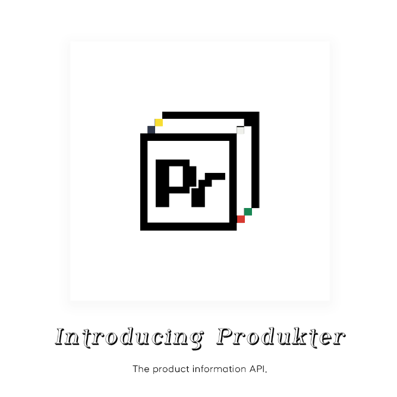
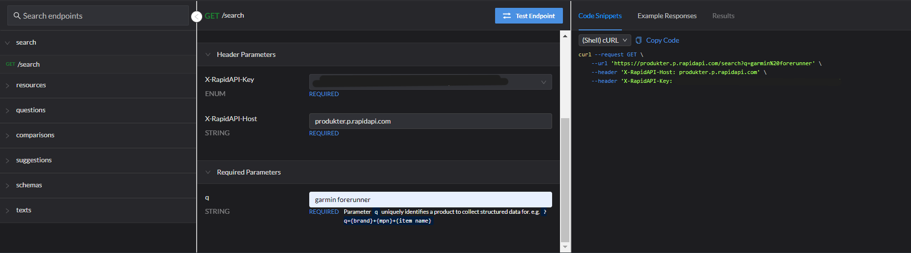

# THE PRODUKTER API

## [Try Out Produkter Online Using RapidAPI](https://rapidapi.com/vanaltrades/api/produkter)

## What can Produkter accomplish for you?

Enterprise businesses, sellers, developers, and ecommerce entrepreneurs require high quality product information to list and rank products online.

High quality content [1] improves rank on search engines and [2] provides a quality product experience that satiates buyers' expectations which leads to conversions.

Produkter allows developers to input a product identifying query and return JSON from multiple endpoints with valuable structured product information related to the input product.

The structured product information (and the api's goal) is designed to allow users to supercharge their merchandising operations.

Use this API to...

* supercharge your large language model for product content.
* collect multimedia assets for your store like image files and pdfs.
* fill in important product schema in your feed like mpns, gtins and brands.
* schedule price comparisons against top product results.
* collect user-generated product reviews to include on your pages.
* extract important product attributes for your target product and load them into your systems.
* understand what titles, descriptions and text top competitors are using to outperform the market.
* identify high demand search queries and questions about your product to highlight search engine optimization content opportunities.

## How does Produkter work?

Produkter requires a product query to be defined at each of its endpoints (?q={}).

Developers can return product information by requesting one of the following endpoints:
* /search?q=
* /resources?q=
* /schemas?q=
* /texts?q=
* /questions?q=
* /comparisons?q=
* /suggestions?q=

e.g. 
`https://produkter.p.rapidapi.com/set_produkt?q={product brand}%20{product mpn}`

* request `https://produkter.p.rapidapi.com/search` for structured product information JSON about the product.

* request `https://produkter.p.rapidapi.com/resources` for document links JSON about the product.

* request `https://produkter.p.rapidapi.com/questions` for popular question queries JSON related to the product.

* request `https://produkter.p.rapidapi.com/comparisons` for popular comparison queries JSON including the product.

* request `https://produkter.p.rapidapi.com/suggestions` for popular queries JSON about the product.

* request `https://produkter.p.rapidapi.com/schemas` for relevant schema JSON associated with the product.

* request `https://produkter.p.rapidapi.com/texts` for relevant text JSON associated with the product.

3. To return JSON on a different product, repeat step 1 with a new `?q` value then proceed to step 2.

## About

Navigate to the Produkter API documentation for detailed examples on accessing the data.

Example JSON responses can be viewed within the documentation "Example Responses" tab.

If a JSON key is not collected from the endpoint because it does not exist for a given `?q`, that key will be ommited from the response JSON.

A full list of possible JSON keys for each endpoint will be added to the documentation soon.